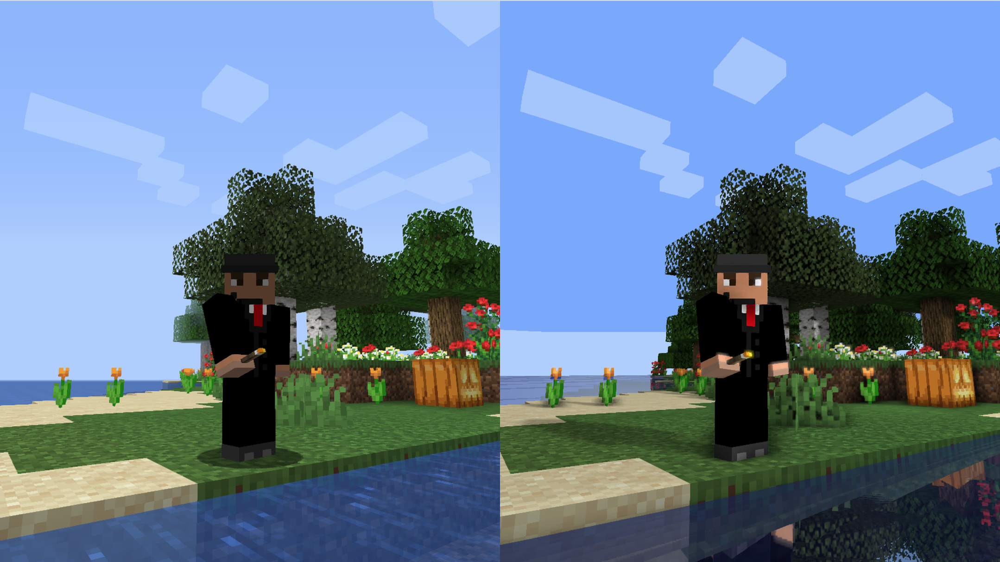
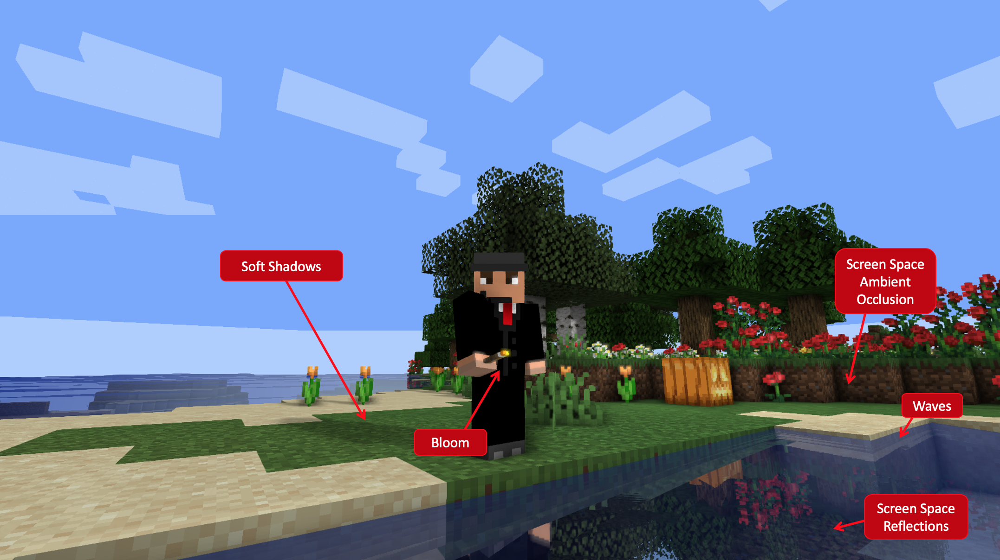
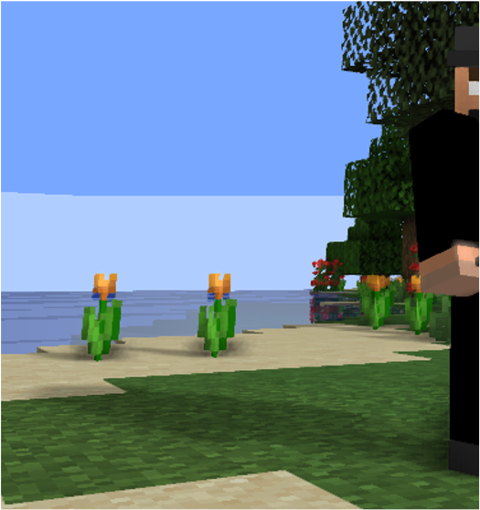
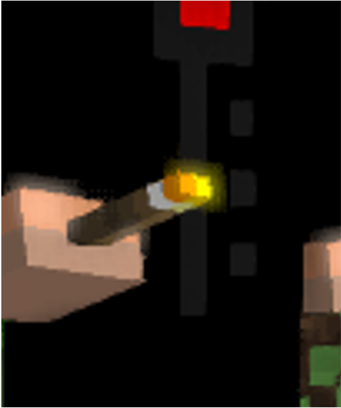
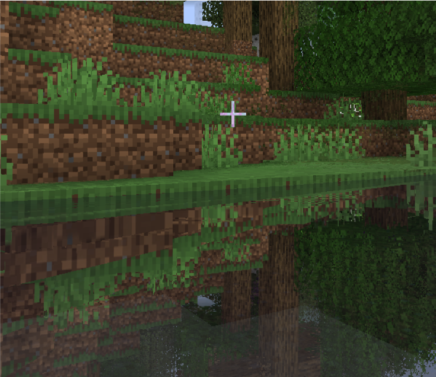
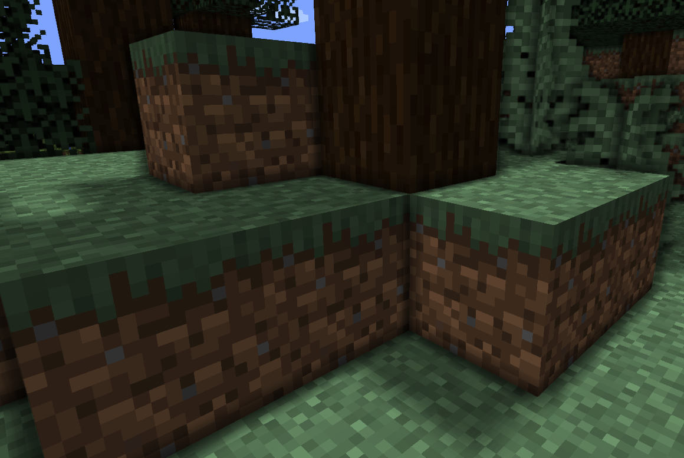

Group 24 - Michael Roust, Szabina Horvath-Mikulas, Erik Wengle

Left: Before our shaderpack, Right: After

# Abstract

Our project consisted of implementing our own shaderpack for Minecraft.
The goal of our project was thus to utilize this mod to
insert our own shaders into the game and make it look stunning! We implemented
soft shadows, screen space reflections, ambient occlusion, wavy water and bloom
into the defered rendering pipeline of the game with some optimizations
to keep the realtime rendering effective.

---

# Technical Approach

Throughout the report we will be using the term "vanilla" to signify
an unmodified verion of Minecraft and "modded" to signify a modified
version of Minecraft.

Minecraft uses a pipeline with multiple shader passes. There are several
fullscreen passes and also geometric passes. Programs such as `gbuffers_terrain` and `gbuffers_water` are only executed for the respective fragments. This is what we use to apply wavyness specifically to water and not other blocks for example.

## Lighting

### Note about the game Lightmap

You may be aware that vanilla Minecraft has some form of lighting. Where the sky lights up any unobstructed blocks directly below and torches light up blocks in a small area around them. This information is stored as a lightmap which is then used as the ambient light stength. This allows a rather lightweight light system and also there to be full darkness in places far from any light source, something not possible if there was just a global ambient lighting. This lighting model in vanilla Minecraft is of course as far from reality as can be. There isn't even any raytracing. Just values falling off over distance.

Our work on lighting consisted can roughly described as adding
the diffuse component to this already exisiting form of dynamic
ambient lighting.

### Making basic shadows work

As practicaly any videogame Minecraft uses a defered rendering pipeline.
To generate shadows in realtime the best method is to use a depthtexture
rendered from the sun's perspective which the pipeline calls shadowtex0.
Since we are also not given a position texture we will need to use a depth texture (rendered from the perspective of the eye) to reconstuct the view space coordinates
of any fragment.

We perform similar transformations to find the nearest point to the sun along
the ray going from the sun and passing through the fragment. Now we perform
the usual check of seeing if the fragment position is behind that nearest point
to the sun or not to determine if the fragment is in shadow.

### Soft shadows

Since the shadowmap is rendered from the perspective of the
sun shadows aren't very detailed and left as is they
have a very noticable pixelated pattern.

To fix this we generate soft shadows using blurring. The most
efficient method appeared to be to use a plain box blur
while applying a random rotation (generated from noise) to the offset when sampling points to blur. The random rotation significantly improves the bluring as that results in not sampling
the exact neighbours of a fragment and each nearby fragment will have different random rotations and thus a somewhat different blur.
We also tried using a gaussian blur but the improvment was negligible.

## Bloom

Our approach was to take fragments with a colour over a certain threshold and add them to a separate color texture. On the following fullscreen pass we blur this color texture using a Gaussian blur and add the result to the fragment color. Making sure we do so in linear space and not gamma space.

## Screen Space Reflection

### Algorithm in general

Screen Space Reflection (SSR) is an algorithm that simulates the reflection of objects in the screen.
We have applied this algorithm for reflecting the screen to the water surface. SSR works by reflecting the screen image onto itself using only itself.

To determine the reflection for each fragment we used the ray marching technique. The algorithm iteratively extends the length of the reflected vector from the fragment in order to sample some space information.
During the calculation of hits, whether or not the reflected ray intersects the screen, we do jump from screen to view space and vicaversa.

We execute the ray marching algorithm during the final pass by extracting the depth information for each fragment from the depth buffer.

Let us call the ray in view space from the camera to the fragment under test (the water fragment) the forward ray. This ray intersects the water surface at the current fragment and its length (distance) is given by the depth buffer (in screen space). The forward ray gets reflected at the current fragment and the reflected ray direction is determined by the normal vector of the current fragment. By the fragment position (interpolated vertex positions) and the normal (interpolated vertex normals) information the direction of the reflected ray is known.

Here comes the iterative process of the algorithm. We need to increment the length of the reflected vector step by step and sample the space whether the reflected ray hits any point in our screen. The iteration can be terminated by defining a maximum length for the reflected ray (indirectly determining the number of iterations, in which the length is incremented iteratively).
An other parameter to define is the delta increment of the vector. It decides the resolution of the process, how many fragments we skip to rerun the process.

We have two passes in our ray marching algorithm. A rough pass that scans the point along the ray where the ray enters or goes behind some geometry.
Then comes the refinement pass which further divides the space and scans for more refined hits within a thickness.

### Our implementation

You find line by line documentation in the water shader final pass.

We get the color information of the fragment from the color texture stored by previous shaders. We check the entity, in case of water we do launch the ray marching algorithm with parameters; forward ray, normal and reflected ray in view space. All three coordinates are known for the sampled point.
These coordinates are then transformed back to screen space. We check in screen space the corresponding real depth coordinate of the sampled fragment. The real coordinates are then transformed back to view space. In view space we can check the difference between the sampled depth coordinate (calculated by the addition of the forward ray and reflected ray) and the real coordinates. If the difference is small enough we can start a refinement pass and modify the incremented vector accordingly. If there was no hit, difference is larger then expected, we continue with the rough pass. We adjust the visibility at the borders.

## Ambient Occlusion

### Algorithm in general

We decided to go with screen space ambient occlusion for performance reasons. We compute an occlusion factor per fragment based on the fragment's surrounding
depth values. The factor is obtained by taking random samples within a unit hemisphere around the fragment's position and then comparing the depth values of each sample with the depth value of the fragment itself.

### Our implementation

The random samples are obtained from the noise texture. We then linearly interpolate the samples to have more samples closer to the fragment itself.
We also add a random rotation when transforming the hemisphere from tangent
to view space in order to reduce the number of samples required to obtain useful information. We then get the sample's position in view space based on the fragment's position in view space. We then get the depth of both the sample and the fragment. If the depth of the sample is greater, the occlusion factor will increase by one. Finally, the occlusion factor is divided by the number of samples. The ambient occlusion factor will be between one and zero, with zero meaning that the fragment is fully occluded.

## Wavy water
In order to make the water more realistic, we modified the vertex y positions (depending on time information) based on sinusodial approach.
As we were asked to implement the noise by other algorithms we used a 3rd party library (listed in references) to deviate further the vertices.

# Results

Unfortunately, we only realised how weakly documented this Minecraft
extension is and took a significant amount of time to understand how to get
going. Due to this we were unable to incorporate Perlin noise into our waves
and weren't able to attempt many extensions.

Nonetheless, we are very happy with the end result. This may have been a
significantly harder project but it feels like we learned more about
game rendering pipelines and producted something that you can actually play
with and not only demonstrate in a 2min video. To whom may be interested
we would be glad to explain how to install the shaderpack to try for themselves.

We also built a custom map to showcase each feature individually, just drag the folder `ICG Demo G24` into your minecraft saves folder and launch minecraft with our shader to see each of the features. We have also included a separate video that gives a full tour of our map. 

# Team contributions

### Michael

- Intial setup and understanding how to interact with the Minecraft rendering pipeline.
- Soft Shadows
- Bloom

### Szabina
- Understanding how to interact with the Minecraft rendering pipeline
- Screen Space Reflection
- Wavy water

### Erik
- Understanding how to interact with the Minecraft rendering pipeline.
- Ambient Occlusion
- Build of the demonstration scene
- Video Demonstration

# References
<!-- TODO Comment these references -->
- https://github.com/sp614x/optifine/blob/master/OptiFineDoc/doc/shaders.txt (documentation of the optifine Mod)
- https://github.com/lettier/3d-game-shaders-for-beginners (understanding SSR)
- https://pastebin.com/aB5MJ7aN (understanding optifine's rendering pipeline)
- https://learnopengl.com/Advanced-Lighting/SSAO (to understand the algorithm for AO)
- https://github.com/ashima/webgl-noise/tree/master/src (noise implementation for water vertex deviation other than sinusodial)

